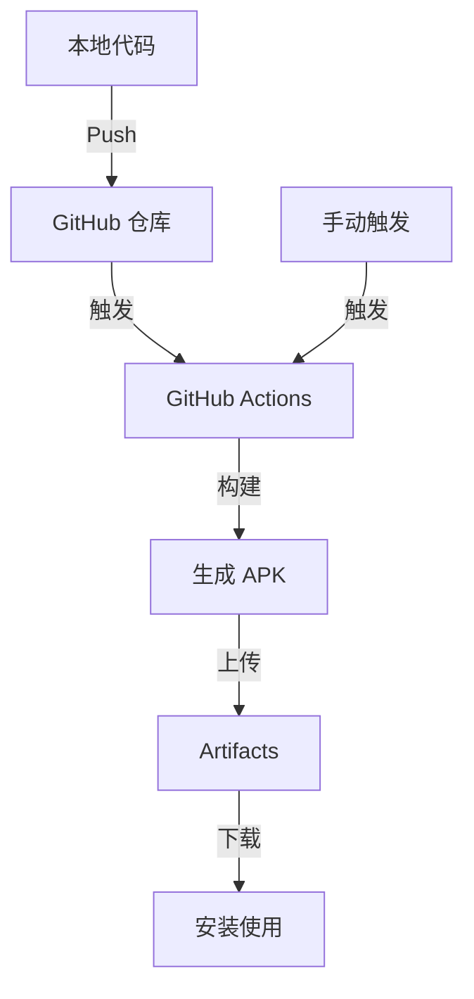

# DemoApp

这是一个基础的 Android Demo 项目，包含多个功能演示页面，包括 UI 组件展示、列表数据、动画手势、传感器功能以及 API 数据获取演示。应用需要登录才能使用所有功能。

## 项目特性
- 最小 SDK 21，目标 SDK 34
- 使用 Java 编写
- 使用 Gradle 构建
- 支持 GitHub Actions 云端自动构建，无需本地安装 Android 环境
- 集成 Material Design 组件
- 使用 Retrofit 和 OkHttp 进行网络请求
- 使用 Gson 解析 JSON 数据
- 使用 ViewBinding 简化视图操作
- 用户身份验证系统，需要登录才能使用功能
- 测试模式支持，简化登录流程（仅需用户名）
- 应用设置系统，支持多种配置选项

## 技术栈

### 前端/UI
- Material Design 组件库
- ConstraintLayout 和其他高级布局
- RecyclerView 和 Adapter 模式
- SwipeRefreshLayout 下拉刷新
- CardView 卡片视图
- ViewBinding 视图绑定

### 网络和数据处理
- Retrofit 网络请求框架
- OkHttp 客户端和拦截器
- Gson JSON解析
- 异步回调处理

### 设备功能
- Android 传感器 API (加速度、光线、距离传感器)
- 系统信息和设备状态 API
- 动画和手势识别

### 开发工具和环境
- Java 编程语言
- Gradle 构建系统
- GitHub Actions CI/CD
- Android SDK (API 21-34)

## 功能模块

### 主要功能
- **UI组件展示**：展示各种 Android UI 组件的使用
- **列表与数据**：展示 RecyclerView 列表和数据处理
- **动画与手势**：展示 Android 动画和手势交互效果
- **传感器与设备功能**：展示 Android 传感器和设备功能使用
- **API数据演示**：展示如何从网络获取和展示 API 数据
- **功能测试页面**：展示各种功能测试和交互效果
- **设置页面**：提供应用配置选项和开发者选项
- **电话功能**：提供输入电话号码并拨打电话的功能

### 用户身份验证
- 应用需要登录才能使用所有功能
- 提供了演示账号（用户名：demo，密码：password）
- 支持用户注册和登录功能
- 个人信息管理
- 测试模式支持：
  - 在测试阶段，仅需输入用户名即可登录（无需密码）
  - 测试模式下会显示明显的指示器提示
  - 可通过 UserManager 类控制测试模式的开启/关闭

### 页面详细功能

#### UI组件展示 (Page1Activity)
- **输入组件**：展示各种文本输入框、密码输入框和下拉菜单
- **选择组件**：展示复选框、单选按钮和开关控件
- **按钮组件**：展示标准按钮、轮廓按钮和其他按钮样式
- **Material Design**：展示符合 Material Design 规范的各种 UI 控件

#### 列表与数据 (Page2Activity)
- **RecyclerView 列表**：展示可滚动的数据列表
- **列表项交互**：点击列表项显示 Toast 提示
- **上下文菜单**：长按列表项显示编辑、删除和分享选项
- **下拉刷新**：使用 SwipeRefreshLayout 实现下拉刷新功能
- **动态添加**：通过浮动按钮动态添加新的列表项
- **数据管理**：展示列表数据的增删改查操作

#### 动画与手势 (Page3Activity)
- **缩放动画**：演示 View 的缩放效果
- **旋转动画**：演示 View 的旋转效果
- **平移动画**：演示 View 的位移效果
- **渐变动画**：演示 View 的透明度变化效果
- **组合动画**：演示多种动画效果的组合使用
- **属性动画**：使用 ObjectAnimator 实现流畅的属性动画效果

#### 传感器与设备功能 (Page4Activity)
- **传感器列表**：显示设备上所有可用的传感器
- **加速度传感器**：实时监测并显示设备的加速度数据
- **光线传感器**：实时监测并显示环境光线强度
- **距离传感器**：实时监测并显示物体与设备的距离
- **电池信息**：显示设备当前电池状态
- **设备信息**：显示设备型号、Android 版本等系统信息
- **手电筒功能**：通过按钮控制手机闪光灯，实现手电筒功能
- **NFC功能**：检测和读取NFC标签信息，显示标签ID和支持的技术

#### API 数据演示 (ApiDemoActivity)
- **网络请求**：使用 Retrofit 从 JSONPlaceholder 公共 API 获取数据
- **数据展示**：在 RecyclerView 中展示获取的 API 数据
- **下拉刷新**：使用 SwipeRefreshLayout 实现数据刷新
- **加载状态**：显示加载中、加载成功和加载失败的不同状态
- **错误处理**：优雅处理网络请求失败的情况
- **日志记录**：使用 LogCat 记录 API 请求过程

#### 功能测试页面 (TestPage2Activity)
- **按钮测试**：测试不同按钮的点击效果和交互
- **进度条**：展示进度条的显示和隐藏效果
- **状态切换**：测试UI元素的可见性切换
- **延时操作**：演示延时任务的执行效果
- **Toast提示**：展示Toast消息提示功能

#### 设置页面 (SettingsActivity)
- **应用设置**：
  - 夜间模式切换：支持切换应用的明暗主题
  - 通知设置：控制应用通知的开启/关闭
- **开发者选项**：
  - 测试模式控制：开启/关闭测试模式（影响登录验证）
  - 详细日志记录：控制应用日志记录级别
- **关于信息**：
  - 版本信息：显示当前应用版本
  - 检查更新：检查应用是否有新版本

## 构建流程图

## 如何自动构建 APK

本项目已集成 GitHub Actions 自动化构建流程：
- 每次 push 到 main 分支会自动触发构建
- 也可以在 GitHub Actions 页面手动点击"Run workflow"触发构建

### 下载 APK
1. 构建完成后，进入 GitHub 仓库的 **Actions** 页面
2. 选择最新的构建记录，找到 **Artifacts** 区域
3. 下载 `app-debug-apk`，即为编译好的 APK 文件

## 本地开发（可选）
如需本地开发，建议使用 Android Studio 打开本项目。

## 快速开始

### 登录信息
- 演示账号：demo
- 密码：password（测试模式下无需输入）

首次启动应用时，需要登录才能访问功能页面。可以使用上述演示账号，或者注册一个新账号。

### 测试模式
当前应用处于测试模式，登录时：
- 只需输入用户名，无需输入密码
- 密码输入框会自动隐藏
- 界面会显示测试模式指示器
- 正式版本发布前，测试模式将被关闭
- 可以在设置页面中手动开启/关闭测试模式

## 使用指南

本应用包含多个功能模块，以下是详细的使用方法：

### 1. 登录与注册
1. **登录**：
   - 启动应用后，如果未登录，将自动跳转到登录页面
   - 输入用户名和密码（测试模式下只需用户名）
   - 点击"登录"按钮进入主页面
   
2. **注册**：
   - 在登录页面点击"注册新账号"
   - 填写用户名、密码和昵称
   - 点击"注册"按钮完成注册

### 2. 主页面导航
主页面展示了所有可用功能的卡片，点击相应卡片进入对应功能页面：
- **UI组件展示**：查看各种Android UI控件
- **列表与数据**：体验列表数据的展示和操作
- **动画与手势**：体验各种动画效果
- **传感器与设备功能**：使用设备传感器和硬件功能
- **API数据演示**：查看网络API数据获取与展示
- **功能测试页面**：测试各种功能
- **设置页面**：调整应用配置
- **电话功能**：拨打电话

### 3. 传感器与设备功能使用
1. **传感器数据**：
   - 点击"加速度"、"光线"或"距离"按钮查看相应传感器数据
   - 再次点击按钮停止监听
   
2. **设备信息**：
   - 点击"设备信息"按钮查看设备详细信息
   - 点击"电池信息"按钮查看电池状态
   
3. **手电筒功能**：
   - 点击"打开手电筒"按钮开启手机闪光灯
   - 再次点击关闭手电筒
   - 首次使用时会请求相机权限
   
4. **NFC功能**：
   - 点击"检测NFC标签"按钮开始监听NFC标签
   - 将NFC标签靠近手机背面进行读取
   - 应用将显示标签ID和支持的技术
   - 如果NFC功能已关闭，应用会提示跳转到系统设置开启

### 4. 电话功能使用
1. **拨打电话**：
   - 在输入框中输入电话号码
   - 点击"拨打电话"按钮发起通话
   - 首次使用时会请求拨打电话权限
   
2. **快速拨号**：
   - 点击"紧急电话"、"联系人1"、"联系人2"或"联系人3"按钮
   - 预设号码会自动填入输入框
   - 点击"拨打电话"按钮发起通话
   
3. **通话记录**：
   - 拨打电话后，通话记录会自动添加到页面底部
   - 最多显示10条最近的通话记录

### 5. 列表与数据操作
1. **查看列表**：
   - 上下滑动查看列表项
   - 点击列表项显示详细信息
   
2. **添加数据**：
   - 点击底部的"+"按钮添加新数据
   
3. **编辑与删除**：
   - 长按列表项显示操作菜单
   - 选择"编辑"或"删除"进行相应操作
   
4. **刷新数据**：
   - 下拉列表进行刷新操作

### 6. 设置页面
1. **应用设置**：
   - 切换夜间模式
   - 开启/关闭通知
   
2. **开发者选项**：
   - 开启/关闭测试模式
   - 调整日志记录级别
   
3. **关于信息**：
   - 查看版本信息
   - 检查更新

### 7. 退出登录
- 在主页面点击"退出登录"按钮
- 或在菜单中选择"退出登录"选项

---

如需自定义功能或遇到问题，欢迎提 Issue！

## 许可证

MIT License