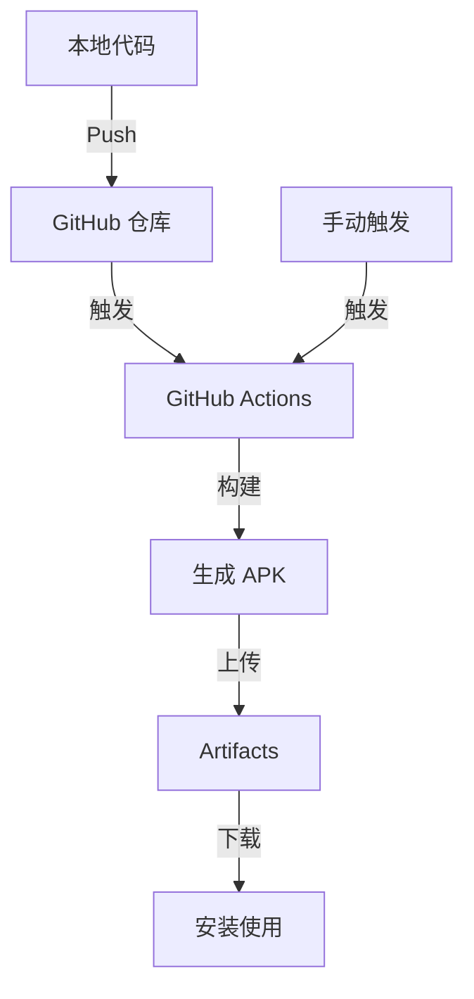

# DemoApp

这是一个最基础的 Android Demo 项目，包含一个简单的 Hello World 主界面。

## 项目特性
- 最小 SDK 21，目标 SDK 34
- 使用 Java 编写
- 使用 Gradle 构建
- 支持 GitHub Actions 云端自动构建，无需本地安装 Android 环境

## 构建流程图

## 如何自动构建 APK

本项目已集成 GitHub Actions 自动化构建流程：
- 每次 push 到 main 分支会自动触发构建
- 也可以在 GitHub Actions 页面手动点击"Run workflow"触发构建

### 下载 APK
1. 构建完成后，进入 GitHub 仓库的 **Actions** 页面
2. 选择最新的构建记录，找到 **Artifacts** 区域
3. 下载 `app-debug-apk`，即为编译好的 APK 文件

## 本地开发（可选）
如需本地开发，建议使用 Android Studio 打开本项目。

---

如需自定义功能或遇到问题，欢迎提 Issue！

## 许可证

MIT License

Copyright (c) 2023

Permission is hereby granted, free of charge, to any person obtaining a copy
of this software and associated documentation files (the "Software"), to deal
in the Software without restriction, including without limitation the rights
to use, copy, modify, merge, publish, distribute, sublicense, and/or sell
copies of the Software, and to permit persons to whom the Software is
furnished to do so, subject to the following conditions:

The above copyright notice and this permission notice shall be included in all
copies or substantial portions of the Software.

THE SOFTWARE IS PROVIDED "AS IS", WITHOUT WARRANTY OF ANY KIND, EXPRESS OR
IMPLIED, INCLUDING BUT NOT LIMITED TO THE WARRANTIES OF MERCHANTABILITY,
FITNESS FOR A PARTICULAR PURPOSE AND NONINFRINGEMENT. IN NO EVENT SHALL THE
AUTHORS OR COPYRIGHT HOLDERS BE LIABLE FOR ANY CLAIM, DAMAGES OR OTHER
LIABILITY, WHETHER IN AN ACTION OF CONTRACT, TORT OR OTHERWISE, ARISING FROM,
OUT OF OR IN CONNECTION WITH THE SOFTWARE OR THE USE OR OTHER DEALINGS IN THE
SOFTWARE. 